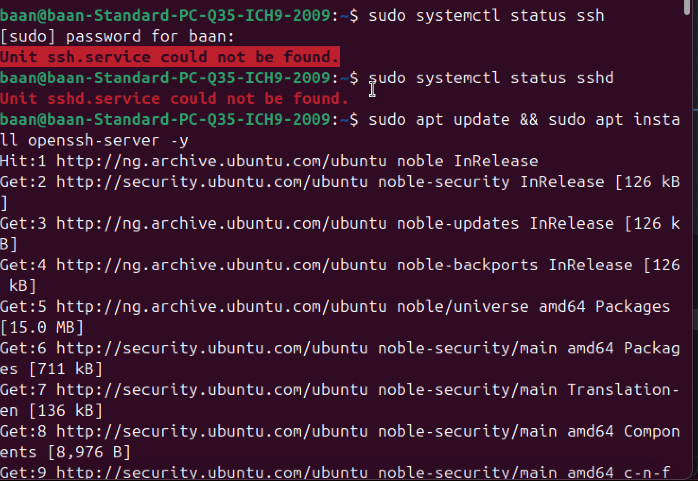
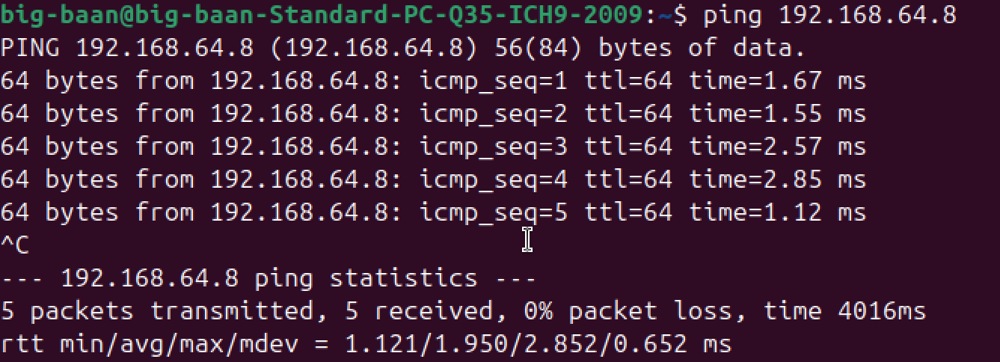

# Linux Server Administration

## Creating a User and Configuring SSH on Both Servers

### Create User
- Create a user (admin)
```bash
sudo useradd -m -s /bin/bash adminuser
```
- setting up ssh for authentication
on my admin server i generated the key pair

```bash
ssh-keygen -t rsa -b 4096 -C "adminuser@big-baan-Standard-PC-Q35-ICH9-2009"
```
- there was a prompt to store my kay pair in a folder to which i used `/home/big-baan/.ssh/id_rsa`

- There was also a prompt to setup a passphrase

### Set up User server to receive ssh
- setup second vm and ran
```bash
hostname -I
```
- got the ip address of the vm
- I then ran
```bash
sudo systemctl status ssh
```
- It returned `Unit ssh.service could not be found.`
- I ran the following command to install the service on the user server

```bash
sudo apt update && sudo apt install openssh-server -y
sudo systemctl start ssh
```



### Check if the servers can find each other
- with the ip gotten from running `hostname -I` on the user server i ran this on the admin server

```bash
ping 192.168.64.8
```


### Copy the public key to target server
```bash
ssh-keygen -t rsa -b 4096 -C "baan@192.168.64.8"
```
- This prompts me to enter my password for the user `baan` on my user server

- After inputing the password i successfully logged into the user server with my public key

1[logged-into-userserver](../screenshots/logged-into-userserver.png)


### Package Management
-Installed the necessary packages on both servers

```bash
sudo apt update && sudo apt install vim curl
```

### Service Management
```bash
sudo apt install openssh-server
sudo systemctl enable ssh
sudo systemctl start ssh
```

```bash
sudo apt install nginx
sudo systemctl enable nginx
sudo systemctl start nginx
```

### File System Management
- checked for any unmounted disk on server (checking for available disk)
```bash
sudo fdisk -l
```
- Checked for where the available disks are being mounted
```bash
lsblk
```
- Checked to see if the partitions are configured to mount automatically at boot
```bash
sudo nano /etc/fstab
```
- Created mount points
```bash
sudo mkdir /mtn/data1
sudo mkdir /mtn/data2
```
- Mounted the linux partitions `/dev/sda2 and /dev/sda3` to the newly created mount points
```bash
sudo mount /dev/sda2 /mnt/data1
```
- To check if mounted correctly
```bash
df -h
```
- Set to mount on boot
```bash
sudo nano /etc/fstab
```
- Add `/dev/sda2 /mnt/data1 ext4 defaults 0 2` to the file
- Unmounted and mounted again to test the `/etc/fstab` configuration
```bash
sudo umount /mnt/data1
sudo mount -a
```
- Verified if they were mounted
```bash
df -h
```