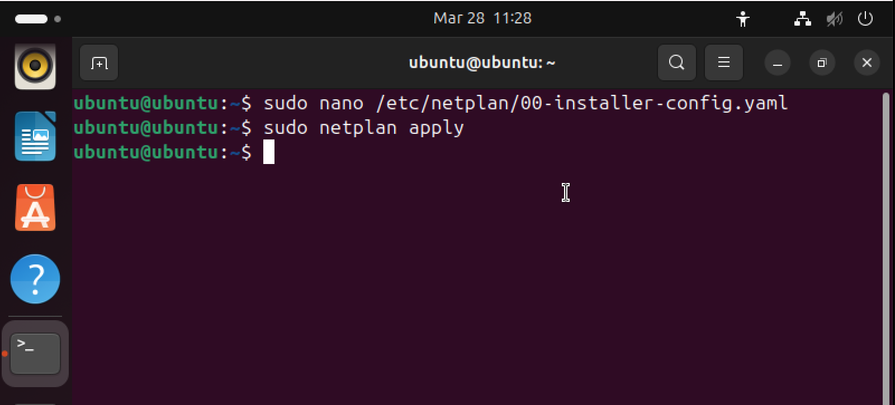

# Setting up Networking Between Servers

## Configure Static IP on Admin and User Server
- Ran this command to open the designated file to pass in configuration information

```bash
sudo nano /etc/netplan/00-installer-config.yaml
```
- In the text editor i opended up, i set up the configuration as;

```yaml
network:
  ethernets:
    ens33:
      addresses:
        - 192.168.1.10/24  (for User server - 192.168.1.11/24) # My static Ip/subnet
      routes:
        - to: default
          via: 192.168.1.1   # Gateway IP
      nameservers:
        addresses: [8.8.8.8, 8.8.4.4]   # DNS servers
      dhcp4: false
  version: 2
```

- Saved and applied the changes

```bash
sudo netplan apply
```


## Firewall configuration with UFW
```bash
sudo ufw allow ssh
sudo ufw enable
```